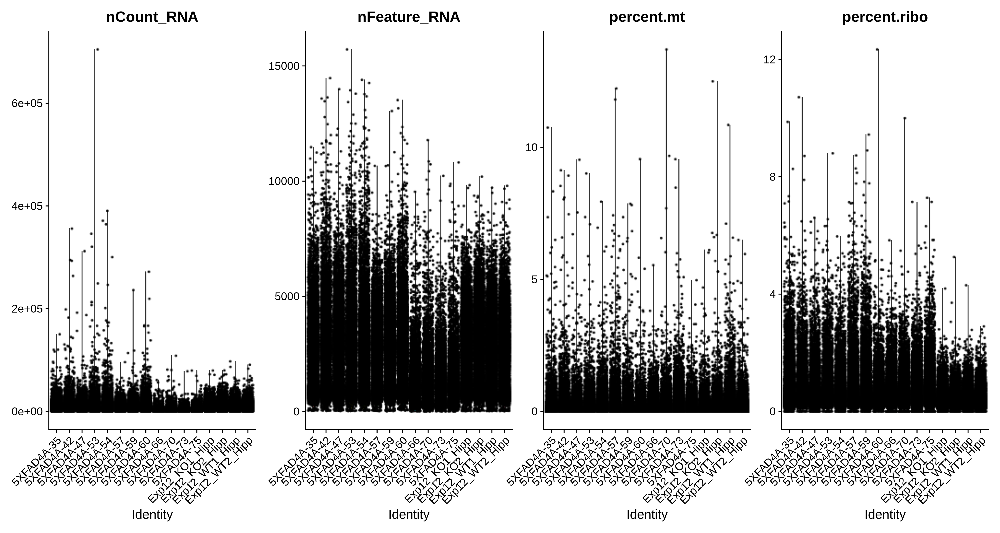
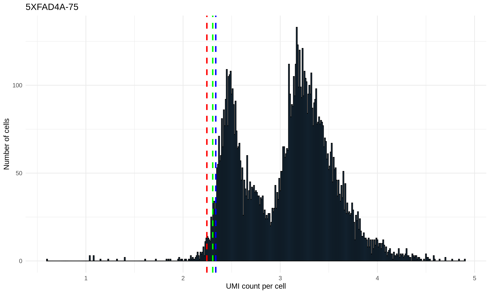
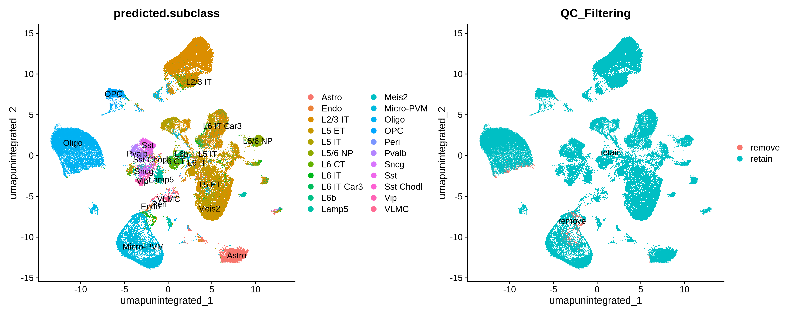
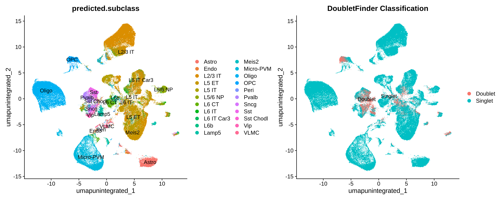
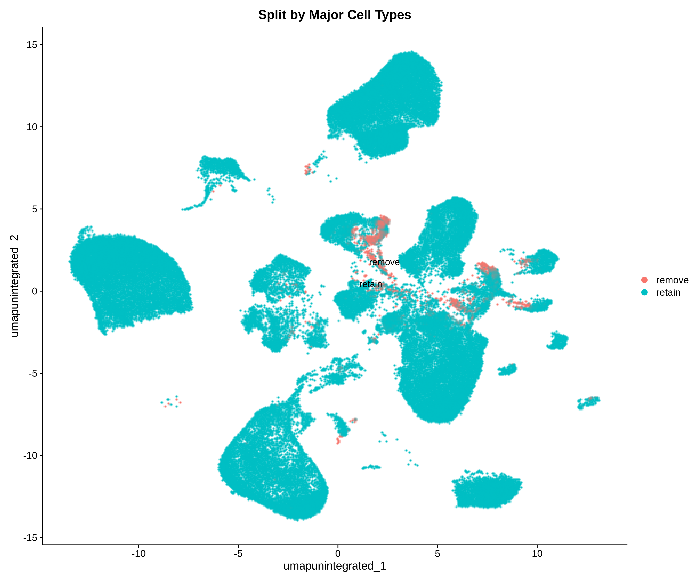
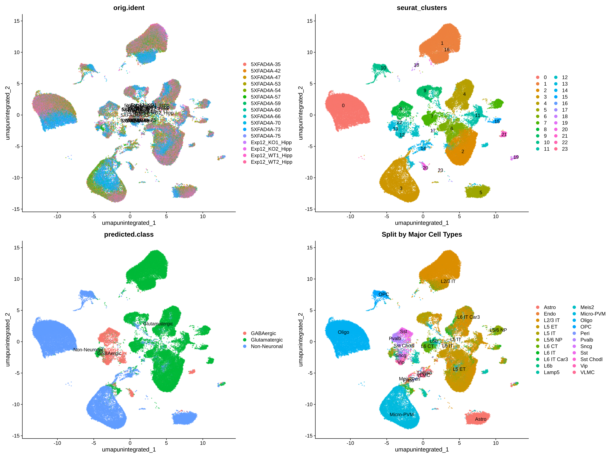
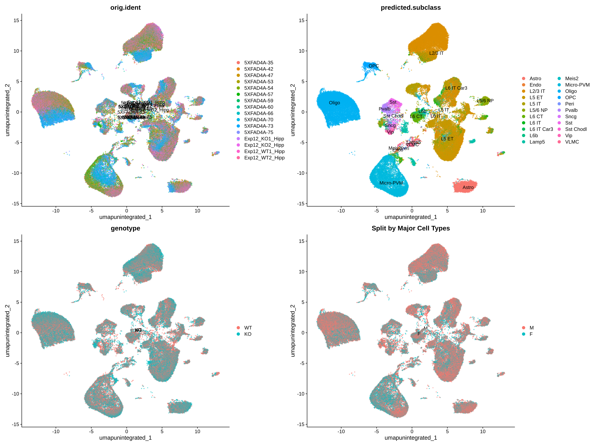

# Ms4a4a-KO-snRNA-seq-analysis

Analysis code for Ms4a4a KO snRNAseq

This repository contains the code and analysis pipeline for the publication by Emma Danhash et al., comparing Ms4a4a wildtype and knockout mice using single-nucleus RNA sequencing.

## Overview

The repository provides a comprehensive workflow for processing and analyzing snRNA-seq data from Ms4a4a WT and KO mice. The analysis includes data preprocessing, quality control, cell type identification, and integration of multiple samples.

## Data Preprocessing Pipeline

The `01_Data_preprocessing.r` script performs the following steps:

1. **Seurat Object Creation**
   - Implements standard Seurat object pipeline
   - Uses Azimuth to predict cell types with mouse motor cortex as reference

2. **Quality Control Filtering**
   - Removes cells with UMI counts in the lower 1% for each donor
   - Retains only cells with <5% mitochondrial content

3. **Doublet Removal**
   - Implements both `scDblFinder` and `DoubletFinder` algorithms
   - Removes cells identified as doublets by either method

  
  

4. **Ambient RNA Removal**
   - Uses DecontX to identify and correct for ambient RNA contamination
   - Removes cells with >20% contamination
   - Sets corrected counts as the default for downstream analysis

  

5. **Cell Type Segregation**
   - Splits the dataset into major cell types based on Azimuth annotation and Seurat clustering
   - Major cell types include: Oligodendrocytes, Astrocytes, Microglia, Excitatory neurons, Inhibitory neurons, OPCs, and Others
   - Performs Harmony integration on each cell type separately

  
  

The `02_Major_celltype_analysis.r` script performs the following steps:

1. **Calculate proportion**
   - Examine if any major cell type is enriched in Ms4a4a KO mice

2. **FindMarkers for all major cell types**
   - Use `FindAllMarkers` for all the major cell types

3. **Doublet Removal**
   - Implements both `scDblFinder` and `DoubletFinder` algorithms
   - Removes cells identified as doublets by either method

4. **Ambient RNA Removal**
   - Uses DecontX to identify and correct for ambient RNA contamination
   - Removes cells with >20% contamination
   - Sets corrected counts as the default for downstream analysis

5. **Cell Type Segregation**
   - Splits the dataset into major cell types based on Azimuth annotation and Seurat clustering
   - Major cell types include: Oligodendrocytes, Astrocytes, Microglia, Excitatory neurons, Inhibitory neurons, OPCs, and Others
   - Performs Harmony integration on each cell type separately

The `03_Subcluster_analysis.r` script performs the following steps:

1. **Define Microglia subclusters**
   - 

2. **FindMarkers for all major cell types**
   - Use `FindAllMarkers` for all the major cell types

3. **Doublet Removal**
   - Implements both `scDblFinder` and `DoubletFinder` algorithms
   - Removes cells identified as doublets by either method

4. **Ambient RNA Removal**
   - Uses DecontX to identify and correct for ambient RNA contamination
   - Removes cells with >20% contamination
   - Sets corrected counts as the default for downstream analysis

5. **Cell Type Segregation**
   - Splits the dataset into major cell types based on Azimuth annotation and Seurat clustering
   - Major cell types include: Oligodendrocytes, Astrocytes, Microglia, Excitatory neurons, Inhibitory neurons, OPCs, and Others
   - Performs Harmony integration on each cell type separately
