# Ms4a4a-KO-snRNA-seq-analysis

Analysis code for Ms4a4a KO snRNAseq

This repository contains the code and analysis pipeline for the publication by **Emma Danhash et al.**, comparing Ms4a4a wildtype and knockout mice using single-nucleus RNA sequencing.

## Overview

The repository provides a comprehensive workflow for processing and analyzing snRNA-seq data from Ms4a4a WT and KO mice. The analysis includes data preprocessing, quality control, cell type identification, and integration of multiple samples.

## Data Preprocessing Pipeline

The `01_Data_preprocessing.r` script performs the following steps:

1. **Seurat Object Creation**
   - Implements standard Seurat object pipeline
   - Uses Azimuth to predict cell types with mouse motor cortex as reference

2. **Quality Control Filtering**
   - Removes cells with UMI counts in the lower 1% for each donor
   - Retains only cells with <5% mitochondrial content

   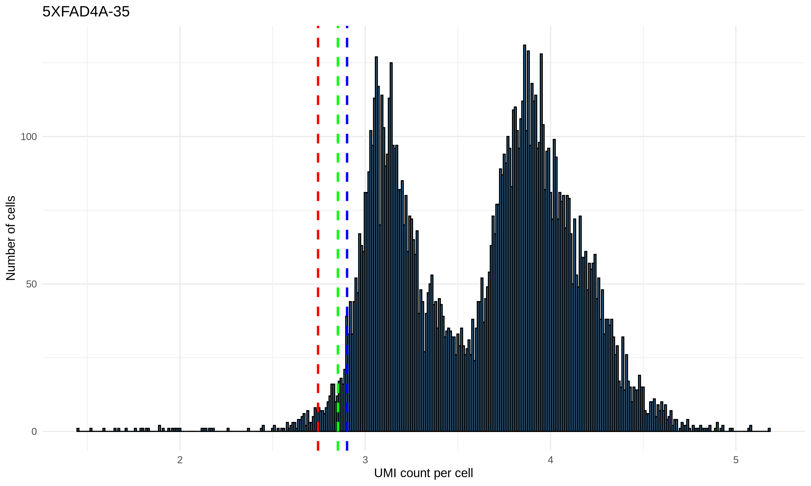
   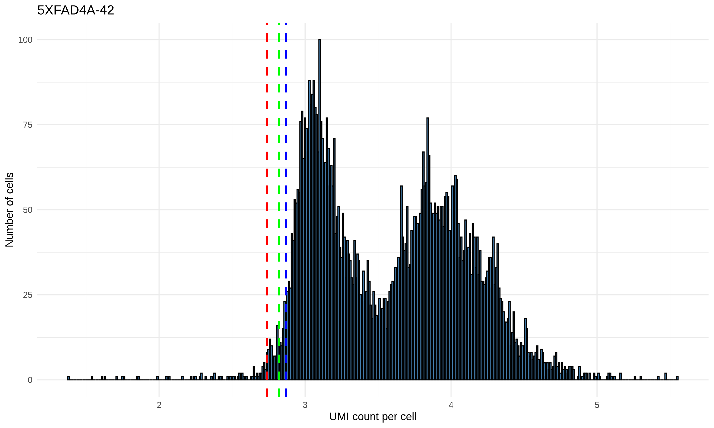
   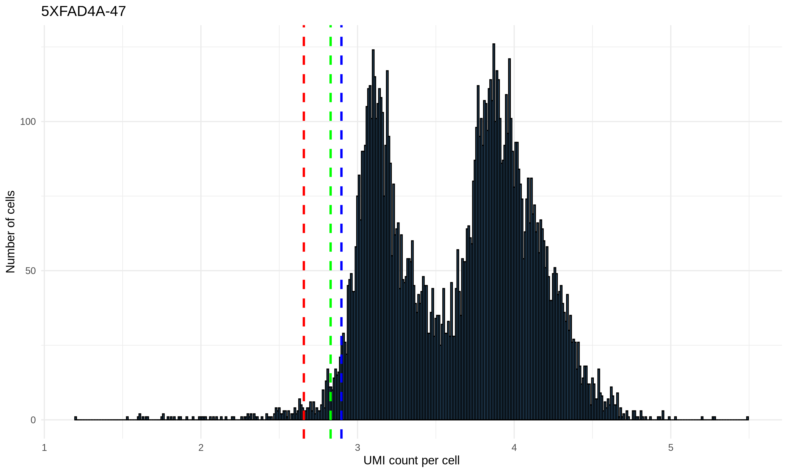
   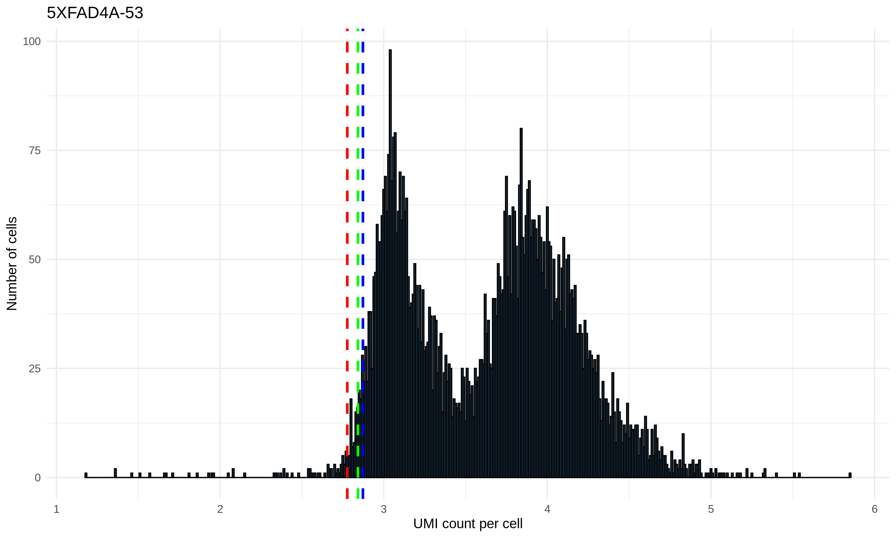
   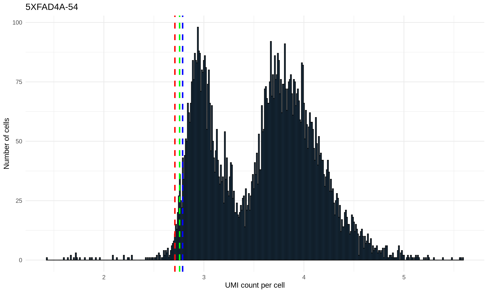
   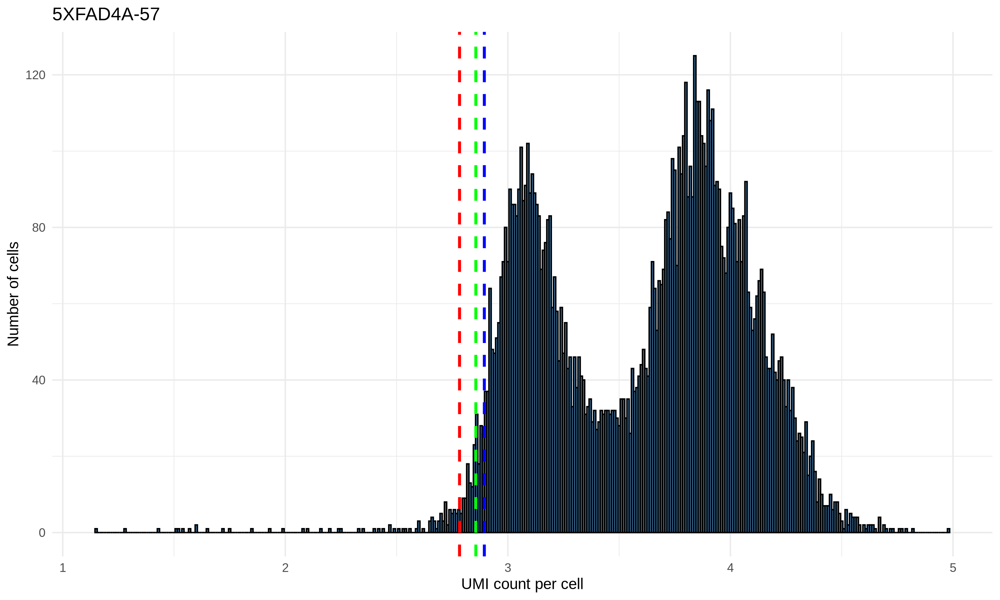
   
   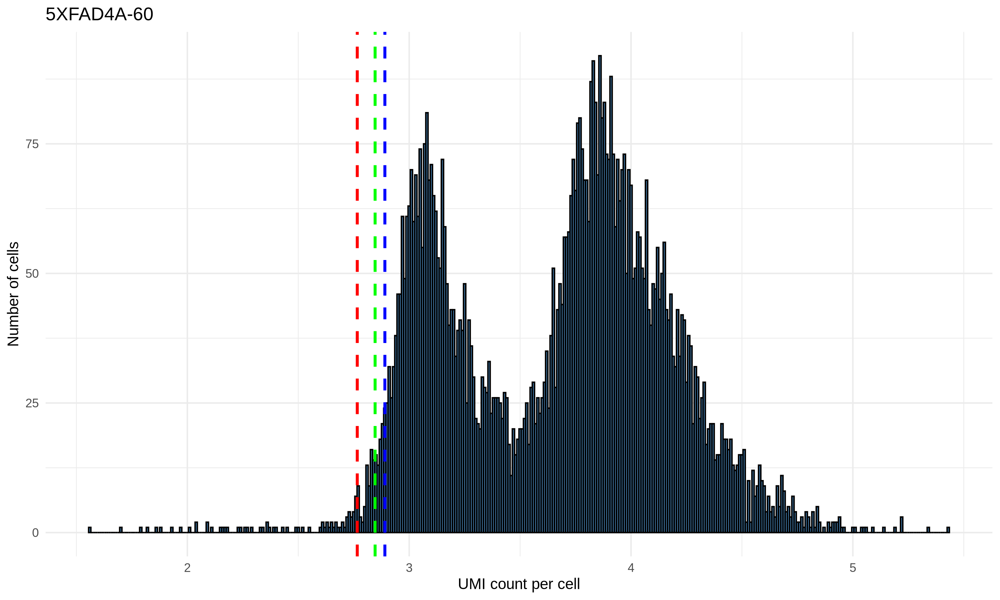

   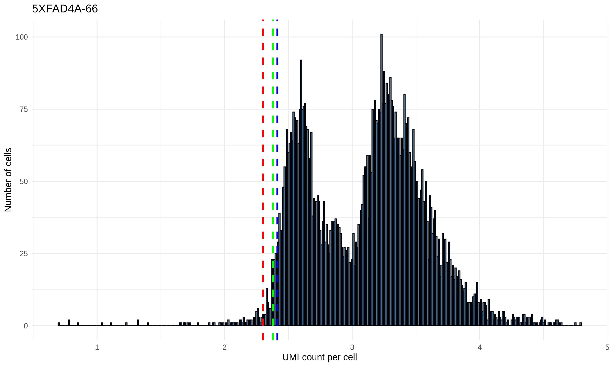
   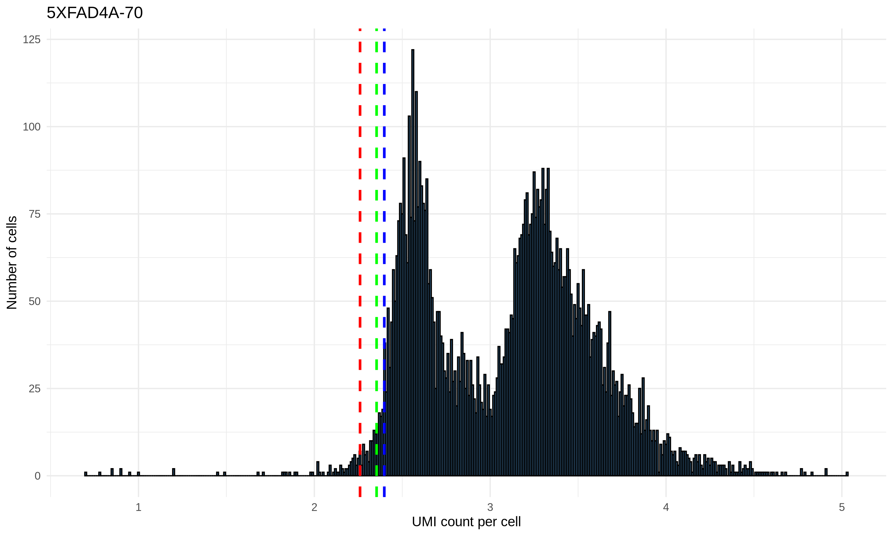
   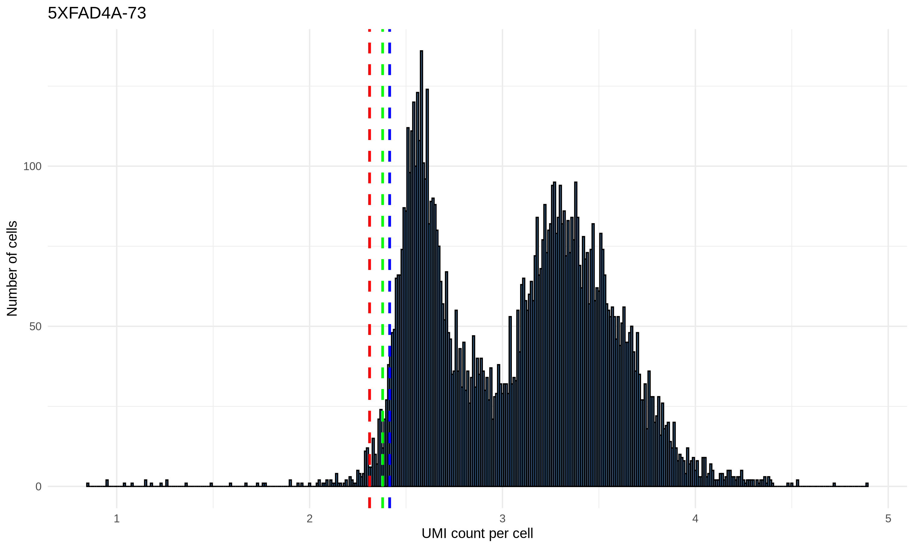
   
   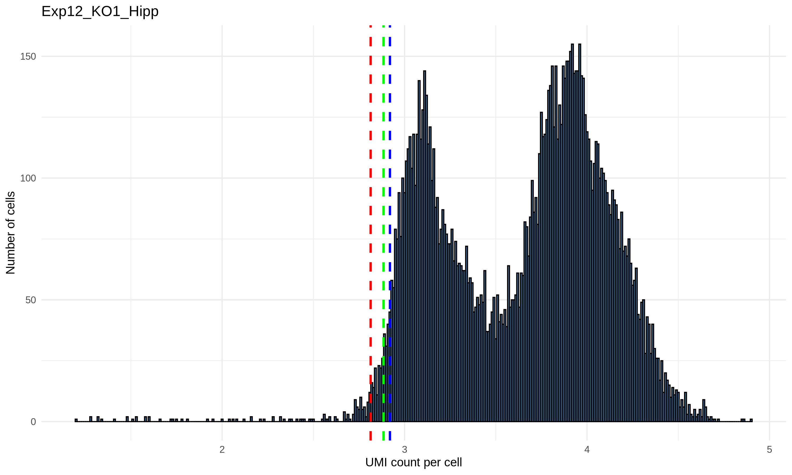
   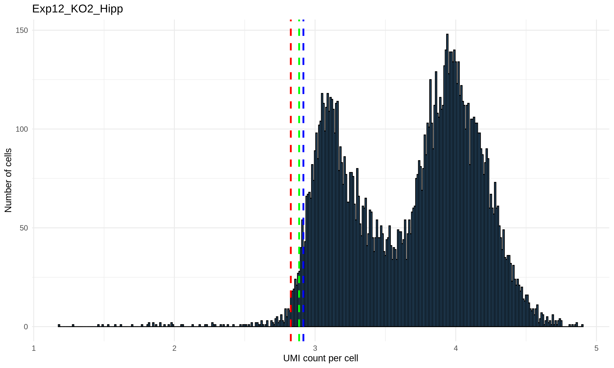
   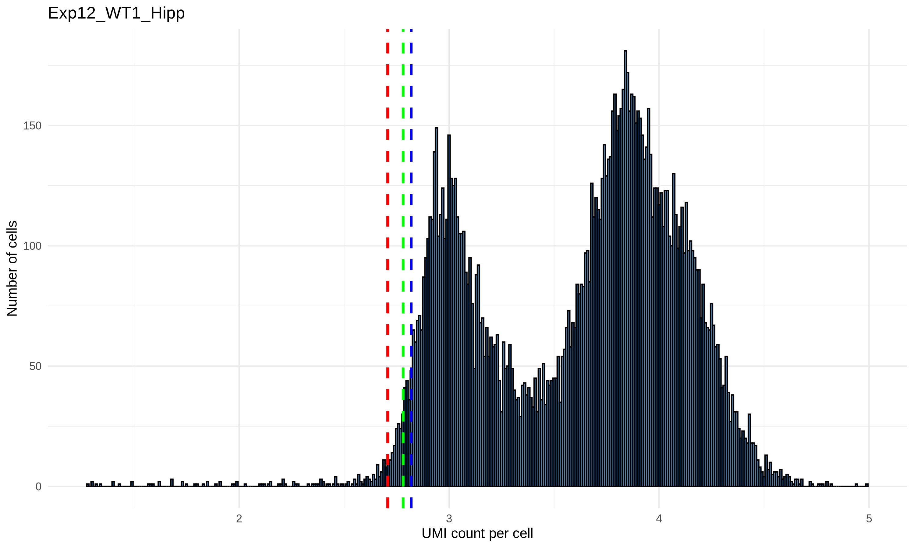
   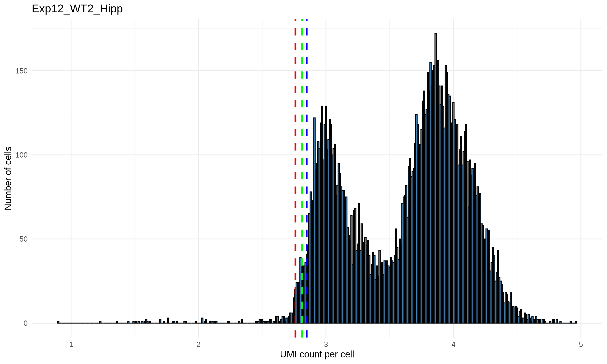

3. **Doublet Removal**
   - Implements both `scDblFinder` and `DoubletFinder` algorithms
   - Removes cells identified as doublets by either method

4. **Ambient RNA Removal**
   - Uses DecontX to identify and correct for ambient RNA contamination
   - Removes cells with >20% contamination
   - Sets corrected counts as the default for downstream analysis

  

5. **Cell Type Segregation**
   - Splits the dataset into major cell types based on Azimuth annotation and Seurat clustering
   - Major cell types include: Oligodendrocytes, Astrocytes, Microglia, Excitatory neurons, Inhibitory neurons, OPCs, and Others (VLMC, Pericytes, etc.)
   - Performs Harmony integration on each cell type separately

  

  

The `02_Major_celltype_analysis.r` script performs the following steps:

1. **Calculate proportion**
   - Examine if any major cell type is enriched in Ms4a4a KO mice

2. **FindMarkers for all major cell types**
   - Use `FindAllMarkers` for all the major cell types

3. **DEG analysis**
   - Using `FindMarkers` to compare Ms4a4a KO vs WT in each of major cell types.

4. **Volcano plot**
   - Using volcano plot to visualize significant DEG (Padj < 0.05)

5. **Pathway analysis**
   - Using `EnrichR` search for biological pathway in databases `KEGG_2019_Mouse`, `GO_Biological_Process_2023`, `GO_Cellular_Component_2023`, `Reactome_2022`, `MSigDB_Hallmark_2020`, `WikiPathways_2024_Mouse` 

The `03_Subcluster_analysis.r` script performs each subclusters in each major cell types in the following steps:

1. **UMAP**
   - Plot UMAP for each harmony_clusters

2. **Calculate proportion**
   - Examine if any subcluster is enriched in Ms4a4a KO mice

3. **FindMarkers for subclusters**
   - Using `FindAllMarkers` for each subclusters

4. **DEG analysis**
   - Using `FindMarkers` to compare Ms4a4a KO vs WT in each of subclusters.

5. **Volcano plot**
   - Using volcano plot to visualize significant DEG (Padj < 0.05)

6. **Pathway analysis**
   - Using `EnrichR` search for biological pathway in databases `KEGG_2019_Mouse`, `GO_Biological_Process_2023`, `GO_Cellular_Component_2023`, `Reactome_2022`, `MSigDB_Hallmark_2020`, `WikiPathways_2024_Mouse` 
